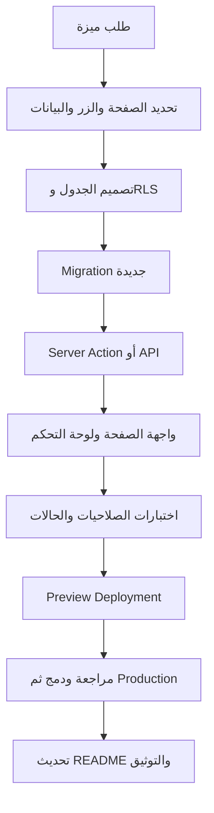

# نظام الدفع متعدد المزودين (Multi-Provider Payment System)

## نظرة عامة

تم بناء نظام دفع متقدم يدعم 3 مزودين للدفع:
- **Paddle** (النشط حالياً)
- **Stripe** (جاهز للتفعيل)
- **PayTabs** (جاهز للتفعيل)

## الميزات الرئيسية

### 1. مزود دفع نشط واحد في كل مرة
- Admin يمكنه التبديل بين المزودين من لوحة التحكم
- لا يوجد حاجة لإعادة تشغيل الموقع
- التبديل فوري وآمن

### 2. دفع بدون حساب مستخدم
- المستخدم يدخل بريده الإلكتروني فقط
- لا حاجة لإنشاء حساب
- الوصول فوري بعد الدفع

### 3. تسجيل شامل للطلبات
- جميع الطلبات محفوظة في `orders` جدول
- تسجيل المستندات في `invoices` جدول
- تتبع الاشتراكات في `student_enrollments` جدول

### 4. الإدارة من لوحة التحكم
- عرض جميع الطلبات والفواتير
- إدارة إعدادات الدفع
- التبديل بين المزودين

## البنية التقنية

### جداول قاعدة البيانات

#### `payment_settings`
```sql
- id: UUID
- provider_name: 'stripe' | 'paddle' | 'paytabs'
- api_key: TEXT (encrypted)
- secret_key: TEXT (encrypted)
- vendor_id: TEXT (Paddle specific)
- webhook_secret: TEXT (encrypted)
- is_active: BOOLEAN (only one true)
```

#### `student_enrollments`
```sql
- id: UUID
- order_id: UUID (FK)
- student_email: TEXT
- course_category: 'quran' | 'arabic'
- total_sessions: INTEGER
- sessions_used: INTEGER
- payment_provider: TEXT
- payment_status: 'pending' | 'completed' | 'refunded'
- is_active: BOOLEAN
```

### API Endpoints

#### GET /api/admin/payment-settings
جلب جميع إعدادات المزودين (مفاتيح مموهة)

```bash
curl http://localhost:3000/api/admin/payment-settings
```

**Response:**
```json
[
  {
    "id": "...",
    "provider_name": "paddle",
    "api_key": "pk_l****a5f0",
    "is_active": true
  }
]
```

#### POST /api/admin/payment-settings
تحديث إعدادات المزود أو التبديل بينهم

```bash
# التبديل إلى مزود آخر
curl -X POST http://localhost:3000/api/admin/payment-settings \
  -H "Content-Type: application/json" \
  -d '{
    "action": "switch_provider",
    "provider_name": "paddle"
  }'

# تحديث الإعدادات
curl -X POST http://localhost:3000/api/admin/payment-settings \
  -H "Content-Type: application/json" \
  -d '{
    "action": "update_provider",
    "provider_name": "paddle",
    "updates": {
      "api_key": "new_key",
      "vendor_id": "123456"
    }
  }'
```

### Webhooks

#### POST /api/webhooks/paddle
معالجة أحداث Paddle:
- `payment_succeeded`: دفع ناجح
- `payment_failed`: دفع فاشل
- `refund_created`: استرجاع مبلغ

**عند دفع ناجح:**
1. ينشئ سجل في `orders`
2. ينشئ تسجيل طالب في `student_enrollments`
3. يحدث الطالب بـ email

## إعداد Paddle

### 1. إنشاء حساب Paddle

```
1. ادخل https://vendor.paddle.com
2. اختر "Sign Up"
3. ملء البيانات الشخصية
4. تحقق من البريد الإلكتروني
```

### 2. الحصول على API Keys

```
1. ادخل Settings → Developer Tools
2. انسخ Vendor ID
3. أنشئ API Key جديد
4. أنشئ Webhook Secret
```

### 3. ربط البنك (Payoneer)

```
1. ادخل Settings → Payout Settings
2. اختر Payoneer
3. ربط حساب Payoneer الخاص بك
4. تأكد من البيانات البنكية
```

### 4. إضافة المفاتيح في Vercel

```
NEXT_PUBLIC_PADDLE_VENDOR_ID=your_vendor_id
PADDLE_API_KEY=your_api_key
PADDLE_WEBHOOK_SECRET=your_webhook_secret
```

### 5. تحديث لوحة التحكم

```
1. ادخل Admin → إعدادات الدفع
2. اختر Paddle من القائمة
3. أدخل المفاتيح في النموذج
4. اضغط "تفعيل"
5. الموقع الآن يقبل الدفع من Paddle
```

## تبديل المزودين

### من لوحة التحكم

```
1. Admin Dashboard → إعدادات الدفع
2. اختر المزود الجديد
3. أضف المفاتيح (إذا لم تكن موجودة)
4. اضغط "تفعيل"
5. الموقع ينتقل فوراً للمزود الجديد
```

### مثال: الانتقال من Paddle إلى Stripe

```
1. ادخل Stripe Dashboard
2. احصل على Live Keys
3. اذهب Admin → إعدادات الدفع
4. اختر Stripe
5. أدخل Stripe Keys
6. اضغط "تفعيل"
7. تم! الموقع يستخدم Stripe الآن
```

## كيفية عمل الدفع

### 1. الطالب يضغط "اشتري"
```
المستخدم يختار الباقة ويضغط "اشتري الآن"
```

### 2. Modal Checkout يظهر
```
- يطلب البريد الإلكتروني
- يختار الكمية (إذا كانت مرنة)
- يضغط "متابعة إلى الدفع"
```

### 3. Frontend يجلب المزود النشط
```javascript
const response = await fetch('/api/admin/payment-settings')
const providers = await response.json()
const activeProvider = providers.find(p => p.is_active)

if (activeProvider.provider_name === 'paddle') {
  // استخدم Paddle Checkout
} else if (activeProvider.provider_name === 'stripe') {
  // استخدم Stripe Checkout
}
```

### 4. الدفع يتم عند المزود
```
Paddle/Stripe يتولى كل عملية الدفع والأمان
```

### 5. Webhook يؤكد الدفع
```
POST /api/webhooks/paddle
- Webhook يتحقق من التوقيع
- ينشئ order في قاعدة البيانات
- ينشئ student_enrollment
- يرسل بريد تأكيد
```

### 6. الطالب يحصل على الوصول
```
يتلقى email بـ:
- تأكيد الدفع
- رابط الوصول للدورة
- تفاصيل الاشتراك
```

## ملفات النظام

### Configuration & Services
- `lib/payment-config.ts` - إدارة إعدادات المزودين
- `lib/paddle-client.ts` - Paddle API client
- `app/actions/paddle.ts` - Server actions

### Admin Dashboard
- `components/admin/PaymentSettingsTab.tsx` - UI لإدارة الإعدادات
- `app/api/admin/payment-settings/route.ts` - API endpoint

### Payment Processing
- `app/api/webhooks/paddle/route.ts` - Paddle webhook handler
- `components/paddle-checkout.tsx` - Paddle checkout UI
- `components/dynamic-checkout.tsx` - Component يختار المزود تلقائياً

### Database
- `supabase/migrations/010_multi_provider_payment_settings.sql` - Schema

## الأمان

### Webhook Verification
جميع webhooks تتحقق من التوقيع قبل المعالجة:
```typescript
const isValid = await verifyPaddleWebhookSignature(body, signature)
```

### Masked API Keys
المفاتيح لا تُظهر كاملة في Admin:
```
Original: pk_live_xxxxxxxxxxxxx
Displayed: pk_l****xxxxx
```

### Database Encryption
Supabase تشفّر المفاتيح تلقائياً في قاعدة البيانات

### RLS Policies
جميع جداول الدفع محمية بـ Row Level Security

## استكشاف الأخطاء

### المشكلة: "No active payment provider configured"

**الحل:**
1. اذهب Admin → إعدادات الدفع
2. تأكد من وجود مزود مع `is_active = true`
3. أضف API keys إذا كانت فارغة
4. اضغط "تفعيل"

### المشكلة: "Invalid webhook signature"

**الحل:**
1. تحقق من webhook secret في قاعدة البيانات
2. تطابق مع webhook secret من Paddle
3. تأكد من الإشارة الصحيحة في Paddle Dashboard

### المشكلة: "Order not created after payment"

**الحل:**
1. تحقق من Supabase env vars محدثة
2. تحقق من الـ webhook logs
3. تأكد من جدول `orders` موجود
4. تحقق من جدول `student_enrollments` موجود

## نصائح الإنتاج

### 1. اختبر مع Test Mode أولاً
```
استخدم Paddle/Stripe test cards
لا تستخدم بيانات حقيقية إلا بعد التأكد
```

### 2. راقب Webhooks
```
ادخل Paddle Dashboard → Developers → Webhooks
شاهد جميع الأحداث والأخطاء
```

### 3. نسخة احتياطية من البيانات
```
نسّخ قاعدة البيانات يومياً
نسّخ المفاتيح في مكان آمن
```

### 4. تحديثات منتظمة
```
ابق محدّث مع آخر نسخة من Paddle API
ابق محدّث مع آخر نسخة من Stripe API
```

## الدعم والتطوير المستقبلي

### الميزات المخطط إضافتها
- [ ] Support for PayTabs fully
- [ ] Invoice PDF generation
- [ ] Refund management dashboard
- [ ] Email templates customization
- [ ] Payment analytics dashboard
- [ ] Subscription management (renewal)
- [ ] Multiple currency support

### التواصل للدعم
- Email: support@quran-elhafez.com
- WhatsApp: +201130127894
- Telegram: @academy_quraan

---

## سياسة الإطلاق الحالية: الدفع مجهّز لكنه مخفي

> **حالة الدفع الحالية:** بنية الدفع والجداول والـ webhooks ولوحة الإعدادات موجودة، لكن زر الدفع وواجهة checkout وتعاملات إنشاء جلسات الدفع **معطّلة وغير ظاهرة للزوار افتراضيًا**. لا يتم تحصيل أي مبلغ ما لم يتم تفعيل مفاتيح التشغيل صراحةً.

يتم التحكم في الإطلاق باستخدام متغيري بيئة مستقلين:

| المتغير | البيئة | الوظيفة | القيمة الافتراضية |
|---|---|---|---|
| `NEXT_PUBLIC_PAYMENTS_ENABLED` | العميل/Preview/Production | إظهار أو إخفاء أزرار الاشتراك وواجهة checkout | غير مضبوط، أي معطّل |
| `PAYMENTS_ENABLED` | الخادم فقط | السماح بإنشاء جلسات Stripe/Paddle | غير مضبوط، أي معطّل |

لإطلاق الدفع لاحقًا يجب ضبط المتغيرين إلى `true` في البيئة المطلوبة فقط، ثم إضافة مفاتيح مزود الدفع واختبار webhooks في وضع الاختبار قبل الإنتاج. لا يكفي ضبط متغير العميل وحده؛ القفل الخادمي يمنع إنشاء جلسة حتى لو حاول مستخدم استدعاء Server Action مباشرةً.

## دليل المطور: كيف تربط صفحة جديدة بقاعدة البيانات

قبل كتابة الكود، حدّد عقد البيانات للصفحة: اسم الجدول، الحقول المطلوبة، حالة النشر، اللغة، المالك، العمليات المسموحة، ومن يستطيع القراءة أو التعديل. لا تضع بيانات CMS الجديدة داخل `useState` فقط إذا كان المطلوب حفظها بين الجلسات.

التسلسل المعتمد هو:

1. أنشئ Migration جديدة داخل `supabase/migrations/` باسم مرتب زمنيًا، مثل `012_add_courses.sql`.
2. استخدم `CREATE TABLE IF NOT EXISTS` عند الإنشاء الجديد، وأضف المفاتيح والقيود والفهارس المناسبة.
3. فعّل RLS لكل جدول جديد، ثم أنشئ سياسات منفصلة للقراءة العامة والكتابة الإدارية. لا تستخدم `auth.role() = 'authenticated'` وحدها للعمليات الحساسة إذا كان المطلوب مشرفًا محددًا؛ اربطها بنموذج `admin_users` أو نموذج الصلاحيات المعتمد.
4. طبّق الـ Migration على بيئة اختبار أو Preview أولًا، ثم تحقّق من الأعمدة والسياسات والبيانات قبل الإنتاج.
5. أضف طبقة خدمة Server-side أو Route Handler/Server Action للتحقق من المدخلات والصلاحيات، ولا تضع `SUPABASE_SERVICE_ROLE_KEY` في مكوّن Client.
6. اربط الصفحة بعمليات القراءة والكتابة مع حالات `loading`, `success`, و`error` واضحة. بعد الحفظ أعد التحقق من البيانات أو استخدم Realtime فقط إذا كانت الصفحة تحتاج تحديثًا لحظيًا.
7. أضف اختبارًا للزائر، والمستخدم المصادق، والمشرف، ومحاولة الكتابة غير المصرح بها.
8. حدّث هذا الملف و`README.md` بذكر الجدول، الـ Migration، الـ API، الصلاحيات، والبيئات المطلوبة.

## دليل المطور: كيف تعدّل جدولًا موجودًا

لا تعدّل Migration قديمة بعد تطبيقها على أي بيئة مشتركة. أنشئ Migration جديدة تحتوي على `ALTER TABLE ... ADD COLUMN IF NOT EXISTS` أو تعديلًا متدرجًا قابلًا للتراجع، ثم اختبر أثره على الصفحات الحالية.

عند تعديل عمود أو حالة، راجع أولًا كل الاستعلامات والمكونات والـ webhooks التي تستخدمه. أضف قيمة افتراضية أو عملية ترحيل للبيانات القديمة إذا كان العمود إلزاميًا. لا تحذف عمودًا أو جدولًا قبل التأكد من عدم استخدامه في الكود أو الـ API أو التقارير، ويفضّل أن يمر الحذف بمرحلة deprecation ثم إزالة لاحقة.

بعد كل تغيير في المخطط:

```text
إنشاء Migration
→ تطبيق على Preview
→ فحص الأعمدة والفهارس وRLS
→ تشغيل اختبارات التطبيق
→ مراجعة Pull Request
→ تطبيق على Production
→ تحديث التوثيق
```

## دليل المطور: كيف تضيف قسمًا أو زرًا جديدًا

كل زر يجب أن يملك وظيفة محددة: انتقال، قراءة، إنشاء، تعديل، حذف، أو إجراء خارجي. إذا لم تكن الوظيفة جاهزة، استخدم Feature Flag أو لا تعرض الزر، ولا تترك زرًا يوحي بأنه ينفذ حفظًا أو دفعًا بينما لا يفعل ذلك.

عند إضافة زر CMS، اربطه بالترتيب التالي: نموذج إدخال، تحقق من القيم، Server Action أو API محمي، عملية Supabase، رسالة نجاح/فشل، ثم تحديث البيانات المعروضة. عند إضافة زر دفع، يجب أن يمر أيضًا عبر `PAYMENTS_ENABLED`, والتحقق من المنتج والسعر من مصدر موثوق، ومنع الاعتماد على السعر القادم من المتصفح، والتحقق من webhook قبل إنشاء الطلب أو enrollment.

## مخطط إضافة ميزة جديدة



## تشغيل الدفع لاحقًا — قائمة إلزامية

قبل جعل الزر ظاهرًا، يجب اختيار مزود واحد، إضافة مفاتيح الاختبار إلى Vercel Preview، تسجيل webhook URL الصحيح، اختبار نجاح وفشل واسترداد، التأكد من عدم تكرار الأحداث، مطابقة المنتج والسعر من الخادم، إنشاء `orders` و`student_enrollments` بعد webhook موثوق فقط، ثم مراجعة سياسات الاسترداد والخصوصية والشروط. بعد نجاح الاختبار يمكن ضبط `NEXT_PUBLIC_PAYMENTS_ENABLED=true` و`PAYMENTS_ENABLED=true` في Production في نافذة إطلاق متعمدة.

لا تُستخدم بيانات بطاقات حقيقية أثناء الاختبار، ولا تُرسل مفاتيح أو أسرار داخل GitHub أو Issues أو التوثيق.
